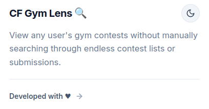
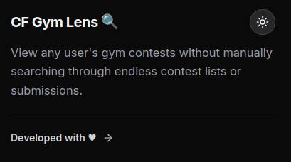

# CF Gym Lens

<p align="center">
  
</p>

<p align="center">
  <strong>A browser extension that adds a "Gyms" tab to Codeforces user profiles, showing gym participation history.</strong>
</p>

<p align="center">
  <a href="#">
    
  </a>
  &nbsp;
  <a href="https://chromewebstore.google.com/detail/cf-gym-lens/cjojbbpjnbcdbikenmcmidpjicpdflac">
    
  </a>
</p>

---

## 📖 About

**CF Gym Lens** enhances Codeforces user profiles by adding a dedicated "Gyms" tab that displays comprehensive gym participation history. View solved problems, submission counts, difficulty ratings, and more—all in a clean, sortable table.

## ✨ Features

- 🏋️ **Gyms Tab**: Adds a new tab to Codeforces user profiles
- 📊 **Comprehensive Data**: Shows contest name, type, publish date, duration, solved/total problems, submissions, and difficulty
- 🔄 **Sortable Columns**: Click any column header to sort the data
- 🔗 **Direct Links**: Click any gym to navigate directly to the contest page

## 📸 Screenshots

### Gyms Tab on User Profile


### Gym History Table


### Popup Light Theme



### Popup Dark Theme



## 🚀 Installation

### Firefox

1. Visit the [Firefox Add-ons page](#)
2. Click "Add to Firefox"
3. Confirm the installation

### Chrome

1. Visit the [Chrome Web Store page](https://chromewebstore.google.com/detail/cf-gym-lens/cjojbbpjnbcdbikenmcmidpjicpdflac)
2. Click "Add to Chrome"
3. Confirm the installation

### Manual Installation (Development)

1. Clone this repository:
   ```bash
   git clone https://github.com/Machamelli/CF-Gym-Lens.git
   ```
2. **Firefox**: Go to `about:debugging` → "This Firefox" → "Load Temporary Add-on" → Select `manifest.json`
3. **Chrome**: Go to `chrome://extensions` → Enable "Developer mode" → "Load unpacked" → Select the extension folder

## 📁 Project Structure

```
CF Gym Lens/
├── manifest.json       # Extension manifest (MV3)
├── content.js          # Content script entry point
├── controller.js       # Main application controller
├── api.js              # Codeforces API interactions
├── data.js             # Data processing and sorting
├── utils.js            # Utility functions
├── ui.js               # UI facade module
├── styles.css          # Extension styles
├── ui/                 # UI submodules (see ui/README.md)
│   ├── dom-utils.js
│   ├── state-renderer.js
│   ├── table-renderer.js
│   └── tab-manager.js
├── popup/              # Extension popup
│   ├── popup.html
│   ├── popup.css
│   ├── popup.js
│   └── fonts/
└── assets/
    ├── icons/          # Extension icons
    └── screenshots/    # Store screenshots
```

## 🔧 How It Works

1. The extension injects a content script into Codeforces profile pages
2. It adds a "GYMS" tab to the existing navigation menu
3. When clicked, it fetches the user's gym participation data via the Codeforces API
4. Data is processed, sorted, and displayed in a feature-rich table
5. Users can sort by any column and click to view specific gyms

## ⚡ Performance

The extension may take a moment to load the "Gyms" tab content as it fetches data from the Codeforces API. This is normal and depends on your internet connection and Codeforces server response times.

## 🛠️ Development

### Prerequisites

- A modern web browser (Firefox or Chrome)
- Basic knowledge of JavaScript and browser extensions

### Building

No build step required! The extension uses vanilla JavaScript and can be loaded directly.

### Testing

1. Load the extension in your browser (see Manual Installation above)
2. Navigate to any Codeforces user profile (e.g., `https://codeforces.com/profile/tourist`)
3. Click the "GYMS" tab to test functionality

## 📝 License

This project is licensed under the MIT License - see the [LICENSE](LICENSE) file for details.

## 🤝 Contributing

Contributions are welcome! Please feel free to submit a Pull Request.

1. Fork the repository
2. Create your feature branch (`git checkout -b feature/AmazingFeature`)
3. Commit your changes (`git commit -m 'Add some AmazingFeature'`)
4. Push to the branch (`git push origin feature/AmazingFeature`)
5. Open a Pull Request

## 🙏 Acknowledgments

- [Codeforces](https://codeforces.com) for providing the platform and API
- All competitive programmers who use gyms for practice

---

<p align="center">
  Made with ❤️ for the competitive programming community
</p>
