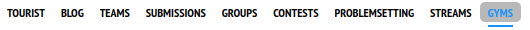
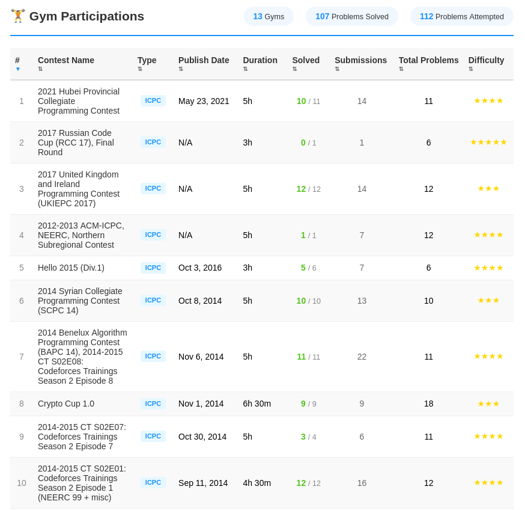

# UI Module

This directory contains the UI subsystem for CF Gym Lens, organized following the **Single Responsibility Principle** and the **Facade Pattern**.

## 📁 Architecture

```
ui/
├── dom-utils.js        # DOM element finding and creation
├── state-renderer.js   # Rendering different UI states
├── table-renderer.js   # Gyms table rendering with sorting
└── tab-manager.js      # Tab states and content visibility
```

The main `ui.js` file (in the root directory) acts as a **Facade**, providing a unified interface to these specialized modules.

## 📦 Modules

### dom-utils.js

**Responsibility**: DOM element finding and basic element creation

| Function                 | Description                                     |
| ------------------------ | ----------------------------------------------- |
| `findNavigationMenu()`   | Locates the Codeforces navigation menu          |
| `createGymsTab(onClick)` | Creates the GYMS tab element with click handler |
| `createGymsContainer()`  | Creates the container for gyms content          |

### state-renderer.js

**Responsibility**: Rendering different UI states (loading, error, empty)

| Function                           | Description                             |
| ---------------------------------- | --------------------------------------- |
| `renderLoading(container)`         | Displays loading spinner with message   |
| `renderError(container, message)`  | Shows error state with retry button     |
| `renderEmpty(container, username)` | Displays empty state when no gyms found |

### table-renderer.js

**Responsibility**: Rendering the gyms table with sorting capabilities

| Function                                                | Description                     |
| ------------------------------------------------------- | ------------------------------- |
| `renderGymsTable(container, gyms, currentSort, onSort)` | Renders the full data table     |
| `generateTableHeader(currentSort)`                      | Creates sortable table headers  |
| `generateTableRow(gym, index)`                          | Generates individual table rows |

**Table Columns**:

- `#` (Recent order)
- Contest Name
- Type
- Publish Date
- Duration
- Solved
- Submissions
- Total Problems
- Difficulty

### tab-manager.js

**Responsibility**: Managing tab states and content visibility

| Function                           | Description                               |
| ---------------------------------- | ----------------------------------------- |
| `toggleContent(showGyms)`          | Toggles between original content and gyms |
| `updateTabActiveState(gymsActive)` | Updates visual tab active states          |
| `setupTabClickHandlers()`          | Sets up click handlers for all tabs       |

## 🔗 Integration

The modules attach themselves to the global `window.GymsExtension.ui` namespace:

```javascript
// Accessing sub-modules directly
window.GymsExtension.ui.domUtils.findNavigationMenu();
window.GymsExtension.ui.stateRenderer.renderLoading(container);
window.GymsExtension.ui.tableRenderer.renderGymsTable(
  container,
  gyms,
  sort,
  onSort,
);
window.GymsExtension.ui.tabManager.toggleContent(true);

// Using facade methods (recommended)
window.GymsExtension.ui.findNavigationMenu();
window.GymsExtension.ui.renderLoading(container);
window.GymsExtension.ui.renderGymsTable(container, gyms, sort, onSort);
window.GymsExtension.ui.toggleContent(true);
```

## 📋 Loading Order

The modules must be loaded in a specific order (defined in `manifest.json`):

1. `ui/dom-utils.js` → attaches `ui.domUtils`
2. `ui/state-renderer.js` → attaches `ui.stateRenderer`
3. `ui/table-renderer.js` → attaches `ui.tableRenderer`
4. `ui/tab-manager.js` → attaches `ui.tabManager`
5. `ui.js` → adds facade methods to `ui`

## 🎨 Styling

UI components use CSS classes prefixed with `gyms-` to avoid conflicts:

| Class                       | Purpose               |
| --------------------------- | --------------------- |
| `.gyms-extension-container` | Main container        |
| `.gyms-loading`             | Loading state wrapper |
| `.gyms-spinner`             | Loading animation     |
| `.gyms-error`               | Error state wrapper   |
| `.gyms-btn`                 | Action buttons        |
| `.gyms-table`               | Data table            |
| `.gyms-th-*`                | Table header columns  |
| `.gyms-sort-*`              | Sort indicators       |

See `styles.css` in the root directory for complete styling.

## 🖼️ Screenshots

### Loading State



### Data Table



## 🛠️ Extending

To add a new UI module:

1. Create a new file in `ui/` directory
2. Follow the IIFE pattern with `"use strict"`
3. Attach to `window.GymsExtension.ui.yourModule`
4. Add to `manifest.json` content scripts (before `ui.js`)
5. Add facade methods to `ui.js` if needed

**Template:**

```javascript
/**
 * Your Module Name
 * Single Responsibility: Description of what it does
 */
(function () {
  "use strict";

  // Ensure namespace exists
  if (!window.GymsExtension) {
    window.GymsExtension = {};
  }
  if (!window.GymsExtension.ui) {
    window.GymsExtension.ui = {};
  }

  // Your functions here
  function yourFunction() {
    // Implementation
  }

  // Export module
  window.GymsExtension.ui.yourModule = {
    yourFunction,
  };
})();
```

## 📝 Dependencies

- `utils.js` - For `escapeHtml()`, `formatDate()`, `formatDuration()`, `getSortTooltip()`
- `styles.css` - For visual styling
